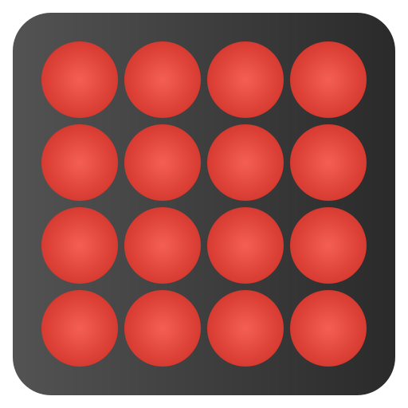
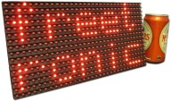
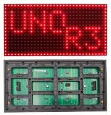

  

# DMD Page Loader

Show images on 2 32x16 HUB12 panels. 

## Hardware Requirements

* Arduino Mega 1560
* 2x 32x16 HUB12 Panels
* SD Card Module
* Rotary Encoder
* SD Card
* (optional) Buzzer

## Known-working Panels

 [Freetronics Red LED Dot Matrix Display Panel 32x16 (Freetronics)](https://www.freetronics.com.au/products/dot-matrix-display-32x16-red)

 [EEEEE P10 Red LED Panel Display (Amazon)](https://www.amazon.com/dp/B08LNYTHZH?psc=1&ref=ppx_yo2ov_dt_b_product_details)

## Features

* Auto looping images
* Fixed image
* Variable display brightness
* Settings menu
* FAT32 file system support
* EEPROM saving

## DMD File Format

| Byte Range       |            Description             |
| ---------------- | ---------------------------------- |
| 0 ... 1023 (3FF) | Image Data (0 = OFF, 1 = ON)       |

## Error Codes

| Code |           Description            |
| ---- | -------------------------------- |
|  1   | SD Card could not be initialized |
|  2   | Could not open SD Card Root      |
|  3   | Could not open SD Card files     |
|  4   | Failed to load image             |